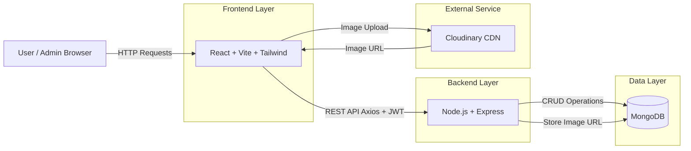

# 🛒 ShopHub – Full-Stack E-Commerce Application

## 📌 Overview 
ShopHub is a full-stack e-commerce web application that allows users to browse products, add them to a cart, and place orders.  
It also includes an admin dashboard where administrators can manage products and view all placed orders.

This project was built as part of a **Full-Stack Development Assignment** to demonstrate end-to-end application development, API design, frontend–backend integration, and role-based access control.

---

## ⚙️ How It Works

### 👤 User Flow
1. Users can register and log in using email and password.
2. Users can browse all available products.
3. Products can be added to a cart (managed on the frontend).
4. Users can place an order from the cart.

### 🛡️ Admin Flow
1. Admin users can access the admin dashboard.
2. Admins can add new products with images.
3. Product images are uploaded to **Cloudinary**.
4. Admins can view all orders placed by users.

### 🔐 Authentication & Authorization
- JWT-based authentication is implemented.
- Role-based access control is used:
  - `USER` → browse products, place orders
  - `ADMIN` → add products, view all orders

---

## 🏗️ System Architecture

## 🧰 Tech Stack Used

### Frontend
- React (Vite)
- Tailwind CSS
- Zustand (state management)
- Axios
- lucide-react (icons)

### Backend
- Node.js
- Express.js
- MongoDB with Mongoose
- JWT (JSON Web Tokens)
- bcrypt.js

### Image Storage
- Cloudinary (image hosting using secure URLs)

### Deployment
- Frontend: Vercel  
- Backend: Render

---

## 🧠 Assumptions Made
- Payment gateway integration is not required.
- Cart data is maintained on the frontend and not persisted in the database.
- Admin accounts are created manually for the purpose of this assignment.
- Backend is hosted on a free Render tier, so initial requests may take a few seconds due to cold starts.
- Image handling is done via third-party cloud storage instead of storing files on the server.

---

## 🧑‍🎓 Candidate Information

- **Name:** Janmejay Pandya  
- **Enrollment Number:** 22070122086
- **Batch:** 2022-2026
- **University:** Symbiosis Institute of Technology, Pune  
- **Role Applied For:** Full-Stack Developer  

---

## 📎 Notes
This project focuses on clarity, clean architecture, and real-world problem solving rather than production-level complexity.
